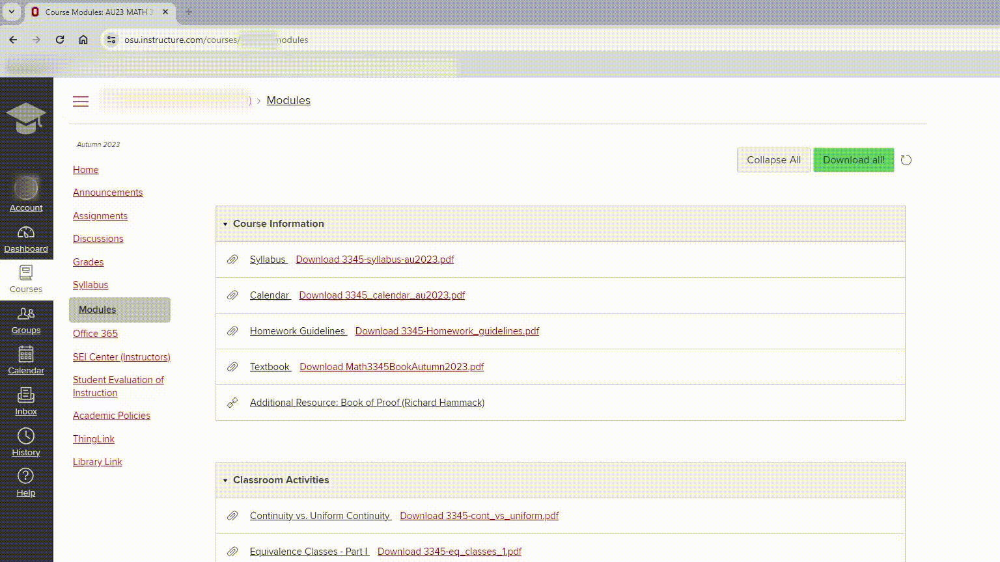
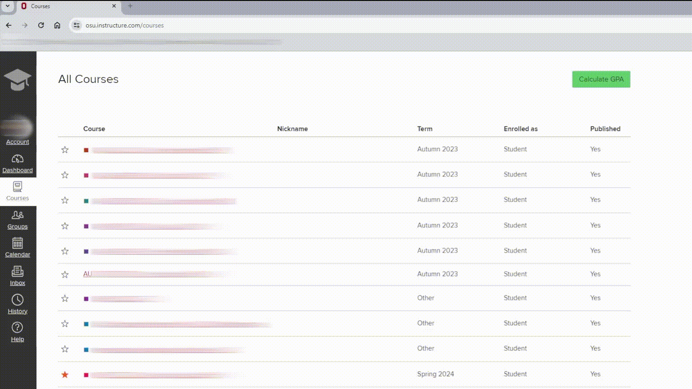

# Canvas Webtoolbox

A chrome extension for canvas.

Hopefully it can make life easier.

## Features

- Download helper
    + Allow you to download all files from modules page of a course in one click.
        <details>

        

        </details>

- GPA calculator
    + Calculating cumulative/semester GPA based on the grades on canvas.
        <details>

        

        </details>

## Install

Release page

## Contribution

Suggestions and pull requests are welcomed!

Especially for the GPA calculator part, we need to write distinct scripts to find the responding credits for every university (check `./src/modules/schools`).

## Build
```bash
npm run build
npm run watch
npm run pack
```

---

This project was bootstrapped with [Chrome Extension CLI](https://github.com/dutiyesh/chrome-extension-cli)

